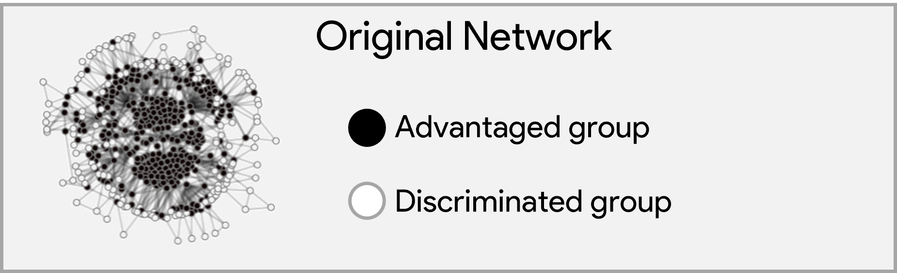

# Structural Group Unfairness: Measurement and Mitigation by means of the Effective Resistance
[📄 Paper - https://arxiv.org/abs/2305.03223](https://arxiv.org/abs/2305.03223)
* **Adrian Arnaiz-Rodriguez, Georgina Curto, Nuria Oliver**
* Accepted at **[ICWSM 2025](https://www.icwsm.org/2025/index.html)**

## Overview
Social networks contribute to the distribution of *social capital*—relationships and norms that enable cooperation within communities. 
We propose three effective resistance-based metrics to quantify **group social capital**:
- **Group Isolation**
- **Group Diameter**
- **Group Control**

These metrics allow us to detect **Structural Group Unfairness**—disparities in access to social capital between groups. We further present a **budgeted edge augmentation heuristic** to reduce such disparities, improving fairness and overall network connectivity.

> We provide different versions of the PyTorch code to compute **Effective Resistance**. More theoretical details about the behaviour of this metric can be found on the **Appendix A of the paper**.

## Contributions
- 📐 **Novel Metrics**: Group-level social capital measures using effective resistance.
- 🧠 **Spectral Graph Theory** foundation (Effective Resistance a.k.a. Commute Time).
- ⚖️ **Structural Group Unfairness** definition & measurement.
- 🛠️ **Mitigation Strategy**: Edge addition heuristic that enhances fairness.
- 📊 **Empirical Validation** on real-world social networks.

## Vizualization

<!-- add gif-->




## Repository Structure
```
.
├── data/                         # Sample datasets or download scripts
├── utils/                        # Core algorithms for measurement and mitigation
|   ├── GraphWrapper.py              # Graph Object optimized for spectral computations and link additions 
|   ├── link_addition_torch.py       # Get edge scores and strongest-weakest ones
|   ├── torch_resistance_metrics.py  # Computation of metrics derived from effective resistance (Group Isolation,...)
|   ├── resistance_metrics.py        # Optimized implementation of effective resistance
|   └── {baseline}.py                # Baseline algorithms for comparison         
└── main_{baseline_}experiment.py # Main scripts to run the measurement and mitigation with diff strategies
```

Run the main experiment:
```bash
python main_experiment.py --links 20 --dataset facebook --model ERP --strategy weak
```
This script runs the end-to-end experiment using the specified configuration:
- `--links`: number of edges to be added
- `--dataset`: dataset name (`facebook`, `google`, `UNC28`)
- `--model`: link prediction model (`ERP`, `deepwalk`, `node2vec`, `random`, `cosine`)
- `--strategy`: link selection strategy (`weak` or `strong`, i.e. link with lowest or highest score). Take into account that some metrics define distances and other ones define similarities.
- `--device`: hardware device to use (`cpu`, `cuda`, etc.)
- `--floattype`: numerical precision (`float32`, `float64`, etc.)

## 📑 Citation
```bibtex
@inproceedings{arnaiz2025structural,
  title={Structural Group Unfairness: Measurement and Mitigation by means of the Effective Resistance},
  author={Arnaiz-Rodriguez, Adrian and Curto, Georgina and Oliver, Nuria},
  booktitle={Proceedings of the International Conference on Web and Social Media (ICWSM)},
  year={2025}
}
```

## Contact
For questions, please contact: [adrian@ellisalicante.org](mailto:adrian@ellisalicante.org)